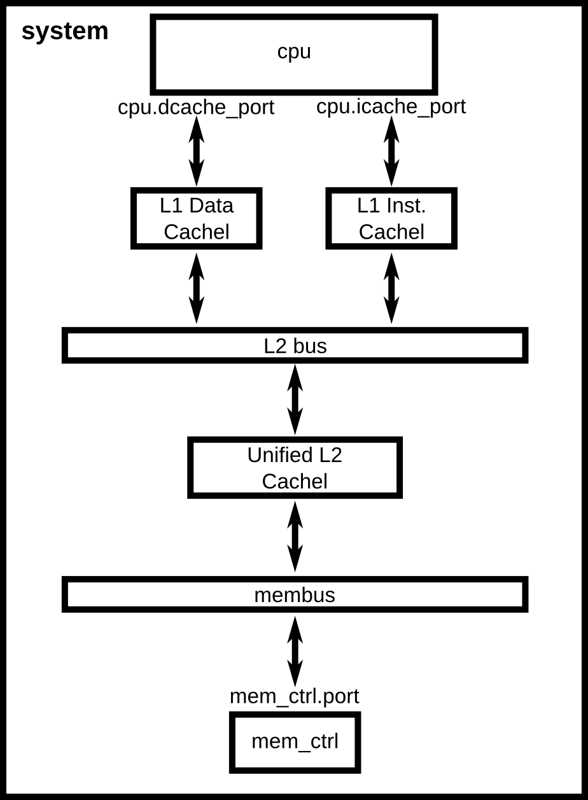

:authors: Jason Lowe-Power

.. _cache-config-chapter:

------------------------------------------
Adding cache to the configuration script
------------------------------------------

Using the :ref:`previous configuration script as a starting point <simple-config-chapter>`, this chapter will walk through a more complex configuration.
We will add a cache hierarchy to the system as shown in :ref:`the figure below <advanced-config-fig>`.
Additionally, this chapter will cover understanding the gem5 statistics output and adding command line parameters to your scripts.

.. _advanced-config-fig:



   A system configuration with a two-level cache hierarchy.


Creating cache objects
~~~~~~~~~~~~~~~~~~~~~~

We are going to use the classic caches, instead of :ref:`ruby-intro-chapter`, since we are modeling a single CPU system and we don't care about modeling cache coherence.
We will extend the Cache SimObject and configure it for our system.
First, we must understand the parameters that are used to configure Cache objects.

.. todo::

   We should add links to SimObjects like Cache that point to the doxygen on gem5's site.

.. sidebar:: Classic caches and Ruby

    gem5 currently has two completely distinct subsystems to model the on-chip caches in a system, the "Classic caches" and "Ruby".
    The historical reason for this is that gem5 is a combination of m5 from Michigan and GEMS from Wisconsin.
    GEMS used Ruby as its cache model, whereas the classic caches came from the m5 codebase (hence "classic").
    The difference between these two models is that Ruby is designed to model cache coherence in detail.
    Part of Ruby is SLICC, a language for defining cache coherence protocols.
    On the other hand, the classic caches implement a simplified and inflexible MOESI coherence protocol.

    To choose which model to use, you should ask yourself what you are trying to model.
    If you are modeling changes to the cache coherence protocol or the coherence protocol could have a first-order impact on your results, use Ruby.
    Otherwise, if the coherence protocol isn't important to you, use the classic caches.

    A long-term goal of gem5 is to unify these to cache models into a single holistic model.

Cache
**********************

The Cache SimObject declaration can be found in :file:`src/mem/cache/Cache.py`.
This Python file defines the parameters which you can set of the SimObject.
Under the hood, when the SimObject is instantiated these parameters are passed to the C++ implementation of the object.
The ``Cache`` SimObject inherits from the ``BaseCache`` object shown below.

.. literalinclude:: /gem5/src/mem/cache/Cache.py
    :lines: 42-


Within the ``BaseCache`` class, there are a number of *parameters*.
For instance, ``assoc`` is an integer parameter.
Some parameters, like ``write_buffers`` have a default value, 8 in this case.
The default parameter is the first argument to ``Param.*``, unless the first argument is a string.
The string argument of each of the parameters is a description of what the parameter is (e.g., ``tag_latency = Param.Cycles("Tag lookup latency")`` means that the ```tag_latency`` controls "The hit latency for this cache").

Many of these parameters do not have defaults, so we are required to set these parameters before calling ``m5.instantiate()``.

----------------------------------------------

Now, to create caches with specific parameters, we are first going to create a new file, ``caches.py``, in the same directory as simple.py, ``configs/tutorial``.
The first step is to import the SimObject(s) we are going to extend in this file.

.. code-block:: python

    from m5.objects import Cache

Next, we can treat the BaseCache object just like any other Python class and extend it.
We can name the new cache anything we want.
Let's start by making an L1 cache.

.. code-block:: python

    class L1Cache(Cache):
        assoc = 2
        tag_latency = 2
        data_latency = 2
        response_latency = 2
        mshrs = 4
        tgts_per_mshr = 20

Here, we are setting some of the parameters of the BaseCache that do not have default values.
To see all of the possible configuration options, and to find which are required and which are optional, you have to look at the source code of the SimObject.
In this case, we are using BaseCache.

We have extended ``BaseCache`` and set most of the parameters that do not have default values in the ``BaseCache`` SimObject.
Next, let's two more sub-classes of L1Cache, an L1DCache and L1ICache

.. code-block:: python

    class L1ICache(L1Cache):
        size = '16kB'

    class L1DCache(L1Cache):
        size = '64kB'

Let's also create an L2 cache with some reasonable parameters.

.. code-block:: python

    class L2Cache(Cache):
        size = '256kB'
        assoc = 8
        tag_latency = 20
        data_latency = 20
        response_latency = 20
        mshrs = 20
        tgts_per_mshr = 12


Now that we have specified all of the necessary parameters required for ``BaseCache``, all we have to do is instantiate our sub-classes and connect the caches to the interconnect.
However, connecting lots of objects up to complex interconnects can make configuration files quickly grow and become unreadable.
Therefore, let's first add some helper functions to our sub-classes of ``Cache``.
Remember, these are just Python classes, so we can do anything with them that you can do with a Python class.

To the L1 cache let's add two functions, ``connectCPU`` to connect a CPU to the cache and ``connectBus`` to connect the cache to a bus.
We need to add the following code to the ``L1Cache`` class.

.. code-block:: python

    def connectCPU(self, cpu):
        # need to define this in a base class!
        raise NotImplementedError

    def connectBus(self, bus):
        self.mem_side = bus.slave

Next, we have to define a separate ``connectCPU`` function for the instruction and data caches, since the I-cache and D-cache ports have a different names.
Our ``L1ICache`` and ``L1DCache`` classes now become:

.. code-block:: python

    class L1ICache(L1Cache):
        size = '16kB'

        def connectCPU(self, cpu):
            self.cpu_side = cpu.icache_port

    class L1DCache(L1Cache):
        size = '64kB'

        def connectCPU(self, cpu):
            self.cpu_side = cpu.dcache_port

Finally, let's add functions to the ``L2Cache`` to connect to the memory-side and CPU-side bus, respectively.

.. code-block:: python

    def connectCPUSideBus(self, bus):
        self.cpu_side = bus.master

    def connectMemSideBus(self, bus):
        self.mem_side = bus.slave

The full file can be found in the gem5 source at ``gem5/configs/learning_gem5/part1/caches.py``.


Adding caches the simple config file
~~~~~~~~~~~~~~~~~~~~~~~~~~~~~~~~~~~~

Now, let's add the caches we just created to the configuration script we created in the :ref:`last chapter <simple-config-chapter>`.

First, let's copy the script to a new name.

.. code-block:: sh

    cp simple.py two_level.py

First, we need to import the names from the ``caches.py`` file into the namespace.
We can add the following to the top of the file (after the m5.objects import), as you would with any Python source.

.. code-block:: python

    from caches import *

Now, after creating the CPU, let's create the L1 caches:

.. code-block:: python

    system.cpu.icache = L1ICache()
    system.cpu.dcache = L1DCache()

And connect the caches to the CPU ports with the helper function we created.

.. code-block:: python

    system.cpu.icache.connectCPU(system.cpu)
    system.cpu.dcache.connectCPU(system.cpu)

Also, You need to *remove* the previous lines which connected the cache ports directly to the memory bus.

.. code-block:: python

    -system.cpu.icache_port = system.membus.slave
    -system.cpu.dcache_port = system.membus.slave

We can't directly connect the L1 caches to the L2 cache since the L2 cache only expects a single port to connect to it.
Therefore, we need to create an L2 bus to connect our L1 caches to the L2 cache.
The, we can use our helper function to connect the L1 caches to the L2 bus.

.. code-block:: python

    system.l2bus = L2XBar()

    system.cpu.icache.connectBus(system.l2bus)
    system.cpu.dcache.connectBus(system.l2bus)

Next, we can create out L2 cache and connect it to the L2 bus and the memory bus.

.. code-block:: python

    system.l2cache = L2Cache()
    system.l2cache.connectCPUSideBus(system.l2bus)

    system.l2cache.connectMemSideBus(system.membus)

Everything else in the file stays the same!
Now we have a complete configuration with a two-level cache hierarchy.
If you run the current file, ``hello`` should now finish in 58513000 ticks.
The full script can be found in the gem5 source at ``gem5/configs/learning_gem5/part1/two_level.py``.

Adding parameters to your script
~~~~~~~~~~~~~~~~~~~~~~~~~~~~~~~~

When performing experiments with gem5, you don't want to edit your configuration script every time you want to test the system with different parameters.
To get around this, you can add command-line parameters to your gem5 configuration script.
Again, because the configuration script is just Python, you can use the Python libraries that support argument parsing.
Although :py:mod:`optparse` is officially deprecated, the configuration scripts that ship with gem5 use it instead of py:mod:`argparse` since gem5's minimum Python version is 2.5.
To get started using :py:mod:`optparse`, you can consult the online Python documentation.

To add options to our two-level cache configuration, after importing our caches, let's add some options.

.. code-block:: python

    from optparse import OptionParser

    parser = OptionParser()
    parser.add_option('--l1i_size', help="L1 instruction cache size")
    parser.add_option('--l1d_size', help="L1 data cache size")
    parser.add_option('--l2_size', help="Unified L2 cache size")

    (options, args) = parser.parse_args()

Now, you can run ``build/X86/gem5.opt configs/tutorial/two_level_opts.py --help`` which will display the options you just added.

Next, we need to pass these options onto the caches that we create in the configuration script.
To do this, we'll simply change two_level.py to pass the options into the caches as a parameter to their constructor and add an appropriate constructor, next.

.. code-block:: python

    system.cpu.icache = L1ICache(options)
    system.cpu.dcache = L1DCache(options)
    ...
    system.l2cache = L2Cache(options)

In caches.py, we need to add constructors (``__init__`` functions in Python) to each of our classes.
Starting with our base L1 cache, we'll just add an empty constructor since we don't have any parameters which apply to the base L1 cache.
However, we can't forget to call the super class's constructor in this case.
If the call to the super class constructor is skipped, gem5's SimObject attribute finding function will fail and the result will be "``RuntimeError: maximum recursion depth exceeded``" when you try to instantiate the cache object.
So, in ``L1Cache`` we need to add the following after the static class members.

.. code-block:: python

    def __init__(self, options=None):
        super(L1Cache, self).__init__()
        pass

Next, in the ``L1ICache``, we need to use the option that we created (``l1i_size``) to set the size.
In the following code, there is guards for if ``options`` is not passed to the ``L1ICache`` constructor and if no option was specified on the command line.
In these cases, we'll just use the default we've already specified for the size.

.. code-block:: python

    def __init__(self, options=None):
        super(L1ICache, self).__init__(options)
        if not options or not options.l1i_size:
            return
        self.size = options.l1i_size

We can use the same code for the ``L1DCache``:

.. code-block:: python

    def __init__(self, options=None):
        super(L1DCache, self).__init__(options)
        if not options or not options.l1d_size:
            return
        self.size = options.l1d_size

And the unified ``L2Cache``:

.. code-block:: python

    def __init__(self, options=None):
        super(L2Cache, self).__init__()
        if not options or not options.l2_size:
            return
        self.size = options.l2_size

With these changes, you can now pass the cache sizes into your script from the command line like below.

.. code-block:: sh

    build/X86/gem5.opt configs/tutorial/two_level_opts.py --l2_size='1MB' --l1d_size='128kB'

::

    gem5 Simulator System.  http://gem5.org
    gem5 is copyrighted software; use the --copyright option for details.

    gem5 compiled Sep  6 2015 14:17:02
    gem5 started Sep  6 2015 15:06:51
    gem5 executing on galapagos-09.cs.wisc.edu
    command line: build/X86/gem5.opt ../tutorial/_static/scripts/part1/two_level_opts.py --l2_size=1MB --l1d_size=128kB

    Global frequency set at 1000000000000 ticks per second
    warn: DRAM device capacity (8192 Mbytes) does not match the address range assigned (512 Mbytes)
    0: system.remote_gdb.listener: listening for remote gdb #0 on port 7000
    Beginning simulation!
    info: Entering event queue @ 0.  Starting simulation...
    Hello world!
    Exiting @ tick 56742000 because target called exit()


The full scripts can be found in the gem5 source at ``gem5/configs/learning_gem5/part1/caches.py`` and ``gem5/configs/learning_gem5/part1/two_level.py``.
