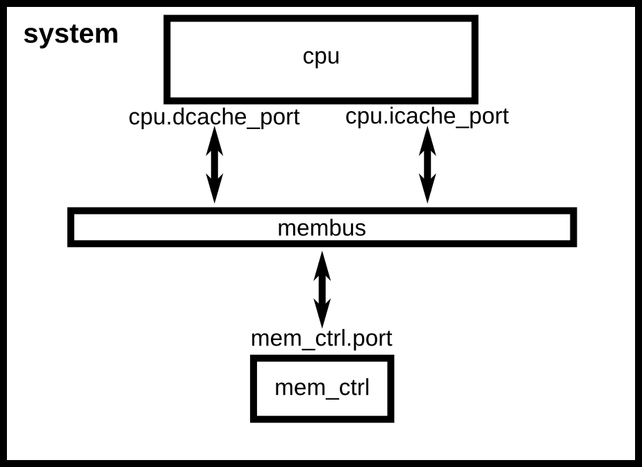

:authors: Jason Power

.. _simple-config-chapter:

---------------------------------------
Creating a simple configuration script
---------------------------------------

This chapter of the tutorial will walk you through how to set up a simple simulation script for gem5 and to run gem5 for the first time.
It's assumed that you've completed the first chapter of the tutorial and have successfully built gem5 with an executable ``build/X86/gem5.opt``.

Our configuration script is going to model a very simple system.
We'll have just one simple CPU core.
This CPU core will be connected to a system-wide memory bus.
And we'll have a single DDR3 memory channel, also connected to the memory bus.

gem5 configuration scripts
~~~~~~~~~~~~~~~~~~~~~~~~~~~

gem5 takes, as a parameter, a python script which sets up and executes the simulation.
In this script, you create a system to simulate, create all of the components of the system, and specify all of the parameters for the system components.
Then, from the script, you can begin the simulation.

There are a number of example configuration scripts that ship with gem5 in ``configs/examples``.
However, these scripts are all encompassing and allow users to specify almost all options on the command line.
In this tutorial, we are going to start with the most simple script that can run gem5 and build off of that.
Hopefully, by the end of this section you'll have a good idea of how simulation scripts work.

An aside on SimObjects
~~~~~~~~~~~~~~~~~~~~~~~~~

gem5's modular design is built around the **SimObject** type.
Most of the components in the simulated system are SimObjects: CPUs, caches, memory controllers, busses, etc.
gem5 exports all of these objects from their ``C++`` implementation to python.
Thus, from the python configuration script you can create any SimObject, set its parameters, and specify the interactions between SimObjects.

Creating a config file
~~~~~~~~~~~~~~~~~~~~~~

Let's start by creating a new config file and opening it:

.. code-block:: sh

    mkdir configs/tutorial
    touch configs/tutorial/simple.py

This is just a normal python file that will be executed by the embedded python in the gem5 executable.
Therefore, you can use any features and libraries available in python.

The first thing we'll do in this file is import the m5 library and all SimObjects that we've compiled.

.. code-block:: python

  import m5
  from m5.objects import *

Next, we'll create the first SimObject, the system that we are going to simulate.
The ``System`` object will be the parent of all the other objects in our simulated system.
The ``System`` object contains a lot of functional (not timing-level) information, like the physical memory ranges, the root clock domain, the root voltage domain, the kernel (in full-system simulation), etc.
To create the system SimObject, we simply instantiate it like any other python class:

.. code-block:: python

  system = System()

Now that we have a reference to the system we are going to simulate, let's set the clock on the system.
We first have to create a clock domain.
Then we can set the clock frequency on that domain.
Setting parameters on a SimObject is exactly the same as setting members of an object in python, so we can simply set the clock to 1 GHz, for instance.
Finally, we have to specify a voltage domain for this clock domain.
Since we don't care about system power right now, we'll just use the default options for the voltage domain.

.. code-block:: python

  system.clk_domain = SrcClockDomain()
  system.clk_domain.clock = '1GHz'
  system.clk_domain.voltage_domain = VoltageDomain()

Once we have a system, let's set up how the memory will be simulated.
We are going to use *timing* mode for the memory simulation.
You'll likely almost always use timing mode for the memory simulation, except in special cases like fast-forwarding and restoring from a checkpoint.
We'll also set up a single memory range of size 512 MB, a very small system.
Note that in the python configuration scripts, whenever a size is required you can specify that size in common vernacular and units like ``'512MB'``.
Similarly, with time you can use time units (e.g., ``'5ns'``).
These will automatically be converted to a common representation, respectively.

.. code-block:: python

  system.mem_mode = 'timing'
  system.mem_ranges = [AddrRange('512MB')]

Now, we can create a CPU.
We'll start with the most simple timing-based CPU in gem5, *TimingSimpleCPU*.
This CPU model executes each instruction in a single clock cycle to execute, except memory requests, which flow through the memory system.
To create the CPU again, you can simply just instantiate the object:

.. code-block:: python

  system.cpu = TimingSimpleCPU()

Next, we're going to create the system-wide memory bus:

.. code-block:: python

  system.membus = SystemXBar()

Now that we have a memory bus, let's connect the cache ports on the CPU to it.
In this case, since the system we want to simulate doesn't have any caches, we will connect the I-cache and D-cache ports directly to the membus.

.. code-block:: python

  system.cpu.icache_port = system.membus.slave
  system.cpu.dcache_port = system.membus.slave

An aside on gem5 ports
**********************

To connect memory system components together, gem5 uses a port abstraction.
Each memory object can have two kinds of ports, *master ports* and *slave ports*.
Requests are sent from a master port to a slave port, and responses are sent from a slave port to a master port.
When connecting ports, you must connect a master port to a slave port.

Connecting ports together is easy to do from the python configuration files.
You can simply set the master port ``=`` to the slave port and they will be connected.
For instance:

.. code-block:: python

  memobject1.master = memobject2.slave

The master and slave can be on either side of the ``=`` and the same connection will be made.
After making the connection, now the master and send requests to the slave port.
There's a lot of magic going on behind the scenes to set up the connection, the details of which are unimportant for most users.

-------------------------

Next, we need to connect up a few other ports to make sure that our system will function correctly.
We need to create an IO controller on the CPU and connect it to the memory bus.
Also, we need to connect a special port in the system up to the membus.
This port is a functional-only port to allow the system to read/write memory.

Connecting the PIO and interrupt ports to the memory bus is an x86-specific requirement.
Other ISAs (e.g., ARM) do not require these 3 extra lines.

.. code-block:: python

  system.cpu.createInterruptController()
  system.cpu.interrupts[0].pio = system.membus.master
  system.cpu.interrupts[0].int_master = system.membus.slave
  system.cpu.interrupts[0].int_slave = system.membus.master

  system.system_port = system.membus.slave

Next, we need to create a memory controller and connect it to the membus.
For this system, we'll use a simple DDR3 controller and it will be responsible for the entire memory range of our system.

.. code-block:: python

  system.mem_ctrl = DDR3_1600_x64()
  system.mem_ctrl.range = system.mem_ranges[0]
  system.mem_ctrl.port = system.membus.master

After those final connections, we've finished instantiating our simulated system!
Our system should look like :ref:`simple-config-fig`.

.. _simple-config-fig:

   A simple system configuration without caches.

Next, we need to set up the process we want the CPU to execute.
Since we are executing in syscall emulation mode (SE mode), we will just point the CPU at the compiled executable.
We'll execute a simple "Hello world" program.
There's already one that is compiled that ships with gem5, so we'll use that.
You can specify any application built for x86 and that's been statically compiled.

First, we have to create the process (another SimObject).
Then we set the processes command to the command we want to run.
This is a list similar to argv, with the executable in the first position and the arguments to the executable in the rest of the list.
Then we set the CPU to use the process as it's workload, and finally create the functional execution contexts in the CPU.

.. code-block:: python

  process = LiveProcess()
  process.cmd = ['tests/test-progs/hello/bin/x86/linux/hello']
  system.cpu.workload = process
  system.cpu.createThreads()

The final thing we need to do is instantiate the system and begin execution.
First, we create the ``Root`` object.
Then we instantiate the simulation.
The instantiation process goes through all of the SimObjects we've created in python and creates the ``C++`` equivalents.

As a note, you don't have to instantiate the python class then specify the parameters explicitly.
You can also pass the parameters as named arguments, like the ``Root`` object below.

.. code-block:: python

  root = Root(full_system = False, system = system)
  m5.instantiate()

Finally, we can begin simulation!

.. code-block:: python

  print "Beginning simulation!"
  exit_event = m5.simulate()

And once simulation finishes, we can inspect the state of the system.

.. code-block:: python

  print 'Exiting @ tick %i because %s' % (m5.curTick(), exit_event.getCause())

Running gem5
~~~~~~~~~~~~~~

Now that we've created a simple simulation script (the full version of which can be found :download:`here <../_static/scripts/part1/simple.py>`)
we're ready to run gem5.
gem5 can take many parameters, but requires just one positional argument, the simulation script.
So, we can simply run gem5 from the root gem5 directory as:

.. code-block:: sh

  build/X86/gem5.opt configs/tutorial/simple.py

The output should be:

::

  gem5 Simulator System.  http://gem5.org
  gem5 is copyrighted software; use the --copyright option for details.

  gem5 compiled Jan 14 2015 16:11:34
  gem5 started Jan 15 2015 11:27:01
  gem5 executing on mustardseed.cs.wisc.edu
  command line: build/X86/gem5.opt configs/tutorial/simple.py
  Global frequency set at 1000000000000 ticks per second
  warn: DRAM device capacity (8192 Mbytes) does not match the address range assigned (512 Mbytes)
  0: system.remote_gdb.listener: listening for remote gdb #0 on port 7000
  Begining simulation!
  info: Entering event queue @ 0.  Starting simulation...
  Hello world!
  Exiting @ tick 345518000 because target called exit()

Paramters in the configuration file can be changed and the results should be different.
For instance, if you double the system clock, the simulation should finish faster.
Or, if you change the DDR controller to DDR4, the performance should be better.

Additionally, you can change the CPU model to ``MinorCPU`` to model an in-order CPU, or ``DerivO3CPU`` to model an out-of-order CPU.
