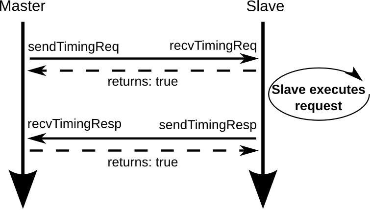
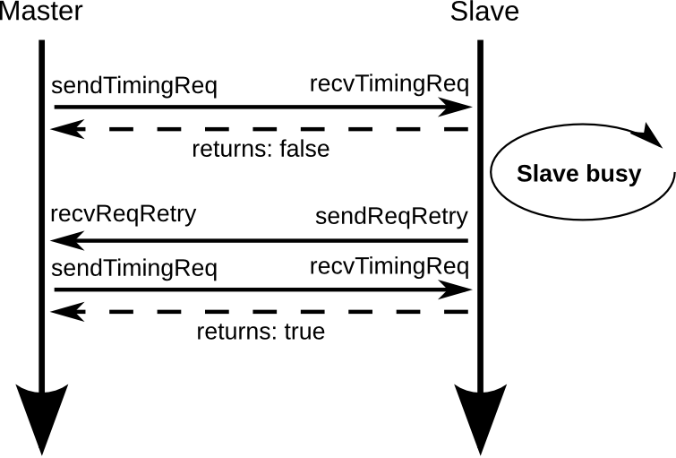
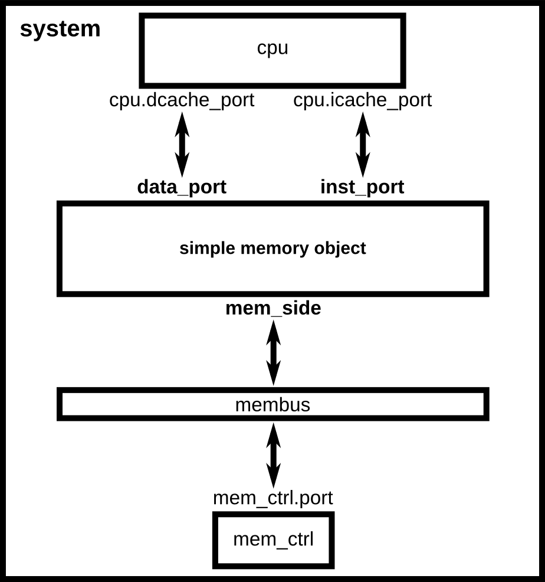
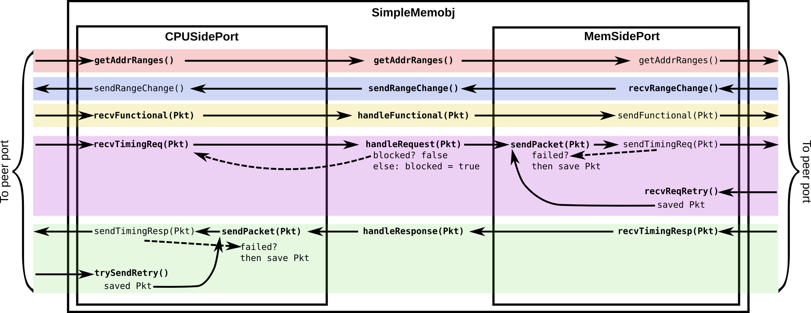

:authors: Jason Lowe-Power

.. _memoryobject-chapter:

------------------------------------------
Creating SimObjects in the memory system
------------------------------------------

In this chapter, we will create a simple memory object that sits between the CPU and the memory bus.
In the :ref:`next chapter <simplecache-chapter>` we will take this simple memory object and add some logic to it to make it a very simple blocking uniprocessor cache.

.. _master-slave-ports-section:

gem5 master and slave ports
~~~~~~~~~~~~~~~~~~~~~~~~~~~

Before diving into the implementation of a memory object, we should first understand gem5's master and slave port interface.
As previously discussed in :ref:`simple-config-chapter`, all memory objects are connected together via ports.
These ports provide a rigid interface between these memory objects.

These ports implement three different memory system *modes*: timing, atomic, and functional.
The most important mode is *timing mode*.
Timing mode is the only mode that produces correct simulation results.
The other modes are only used in special circumstances.

*Atomic mode* is useful for fastforwarding simulation to a region of interest and warming up the simulator.
This mode assumes that no events will be generated in the memory system.
Instead, all of the memory requests execute through a single long callchain.
It is not required to implement atomic accesses for a memory object unless it will be used during fastforward or during simulator warmup.

*Functional mode* is better described as *debugging mode*.
Functional mode is used for things like reading data from the host into the simulator memory.
It is used heavily in syscall emulation mode.
For instance, functional mode is used to load the binary in the ``process.cmd`` from the host into the simulated system's memory so the simulated system can access it.
Functional accesses should return the most up-to-date data on a read, no matter where the data is, and should update all possible valid data on a write (e.g., in a system with caches there may be multiple valid cache blocks with the same address).

Packets
#######

In gem5, ``Packets`` are sent across ports.
A ``Packet`` is made up of a ``MemReq`` which is the memory request object.
The ``MemReq`` holds information about the original request that initiated the packet such as the requestor, the address, and the type of request (read, write, etc.).

Packets also have a ``MemCmd``, which is the *current* command of the packet.
This command can change throughout the life of the packet (e.g., requests turn into responses once the memory command is satisfied).
The most common ``MemCmd`` are ``ReadReq`` (read request), ``ReadResp`` (read response), ``WriteReq`` (write request), ``WriteResp`` (write response).
There are also writeback requests (``WritebackDirty``, ``WritebackClean``) for caches and many other command types.

Packets also either keep the data for the request, or a pointer to the data.
There are options when creating the packet whether the data is dynamic (explicitly allocated and deallocated), or static (allocated and deallocated by the packet object).

Finally, packets are used in the classic caches as the unit to track coherency.
Therefore, much of the packet code is specific to the classic cache coherence protocol.
However, packets are used for all communication between memory objects in gem5, even if they are not directly involved in coherence (e.g., DRAM controllers and the CPU models).

All of the port interface functions accept a ``Packet`` pointer as a parameter.
Since this pointer is so common, gem5 includes a typedef for it: ``PacketPtr``.

Port interface
##############

There are two types of ports in gem5: master ports and slave ports.
Whenever you implement a memory object, you will implement at least one of these types of ports.
To do this, you create a new class that inherits from either ``MasterPort`` or ``SlavePort`` for master and slave ports, respectively.
Master ports send requests (and receive response), and slave ports receive requests (and send responses).

:ref:`master-slave-1-fig` outlines the simplest interaction between a master and slave port.
This figure shows the interaction in timing mode.
The other modes are much simpler and use a simple callchain between the master and the slave.

.. _master-slave-1-fig:

   Simple master-slave interaction when both can accept the request and the response.

As mentioned above, all of the port interfaces require a ``PacketPtr`` as a parameter.
Each of these functions (``sendTimingReq``, ``recvTimingReq``, etc.), accepts a single parameter, a ``PacketPtr``.
This packet is the request or response to send or receive.

To send a request packet, the master calls ``sendTimingReq``.
In turn, (and in the same callchain), the function ``recvTimingReq`` is called on the slave with the same ``PacketPtr`` as its sole parameter.

The ``recvTimingReq`` has a return type of ``bool``.
This boolean return value is directly returned to the calling master.
A return value of ``true`` signifies that the packet was accepted by the slave.
A return value of ``false``, on the other hand, means that the slave was unable to accept and the request must be retried sometime in the future.

In :ref:`master-slave-1-fig`, first, the master sends a timing request by calling ``sendTimingReq``, which in turn calls ``recvTimingResp``.
The slave, returns true from ``recvTimingResp``, which is returned from the call to ``sendTimingReq``.
The master continue executing, and the slave does whatever is necessary to complete the request (e.g., if it is a cache, it looks up the tags to see if there is a match to the address in the request).

Once the slave completes the request, it can send a response to the master.
The slave calls ``sendTimingResp`` with the response packet (this should be the same ``PacketPtr`` as the request, but it should now be a response packet).
In turn, the master function ``recvTimingResp`` is called.
The master's ``recvTimingResp`` function returns ``true``, which is the return value of ``sendTimingResp`` in the slave.
Thus, the interaction for that request is complete.

Later in :ref:`master-slave-example-section` we will show the example code for these functions.

It is possible that the master or slave is busy when they receive a request or a response.
:ref:`master-slave-2-fig` shows the case where the slave is busy when the original request was sent.

.. _master-slave-2-fig:

   Simple master-slave interaction when the slave is busy

In this case, the slave returns ``false`` from the ``recvTimingReq`` function.
When a master receives false after calling ``sendTimingReq``, it must wait until the its function ``recvReqRetry`` is executed.
Only when this function is called is the master allowed to retry calling ``sendTimingRequest``.
The above figure shows the timing request failing once, but it could fail any number of times.
Note: it is up to the master to track the packet that fails, not the slave.
The slave *does not* keep the pointer to the packet that fails.

Similarly, :ref:`master-slave-3-fig` shows the case when the master is busy at the time the slave tries to send a response.
In this case, the slave cannot call ``sendTimingResp`` until it receives a ``recvRespRetry``.

.. _master-slave-3-fig:

.. figure:: ../_static/figures/master_slave_3.png
   :width: 40 %
   :alt: Master busy interaction

   Simple master-slave interaction when the master is busy

Importantly, in both of these cases, the retry codepath can be a single call stack.
For instance, when the master calls ``sendRespRetry``, ``recvTimingReq`` can also be called in the same call stack.
Therefore, it is easy to incorrectly create an infinite recursion bug, or other bugs.
It is important that before a memory object sends a retry, that it is ready *at that instant* to accept another packet.

.. _master-slave-example-section:

Simple memory object example
~~~~~~~~~~~~~~~~~~~~~~~~~~~~

In this section, we will build a simple memory object.
Initially, it will simply pass requests through from the CPU-side (a simple CPU) to the memory-side (a simple memory bus).
See Figure :ref:`simple-memobj-figure`.
It will have a single master port, to send requests to the memory bus, and two cpu-side ports for the instruction and data cache ports of the CPU.
In the :ref:`next chapter <simplecache-chapter>`, we will add the logic to make this object a cache.

.. _simple-memobj-figure:

   System with a simple memory object which sits between a CPU and the memory bus.

Declare the SimObject
######################

Just like when we were creating the simple SimObject in :ref:`hello-simobject-chapter`, the first step is to create a SimObject Python file.
We will call this simple memory object ``SimpleMemobj`` and create the SimObject Python file in ``src/learning_gem5/simple_memobj``.

.. code-block:: python

    from m5.params import *
    from m5.proxy import *
    from MemObject import MemObject

    class SimpleMemobj(MemObject):
        type = 'SimpleMemobj'
        cxx_header = "learning_gem5/simple_memobj/simple_memobj.hh"

        inst_port = SlavePort("CPU side port, receives requests")
        data_port = SlavePort("CPU side port, receives requests")
        mem_side = MasterPort("Memory side port, sends requests")

For this object, we inherit from ``MemObject``, not ``SimObject`` since we are creating an object that will interact with the memory system.
The ``MemObject`` class has two pure virtual functions that we will have to define in our C++ implementation, ``getMasterPort`` and ``getSlavePort``.

This object's parameters are three ports.
Two ports for the CPU to connect the instruction and data ports and a port to connect to the memory bus.
These ports do not have a default value, and they have a simple description.

It is important to remember the names of these ports.
We will explicitly use these names when implementing ``SimpleMemobj`` and defining the ``getMasterPort`` and ``getSlavePort`` functions.

You can download the SimObject file :download:`here <../_static/scripts/part2/memoryobject/SimpleMemobj.py>`

Of course, you also need to create a SConscript file in the new directory as well that declares the SimObject Python file.
You can download the SConscript file :download:`here <../_static/scripts/part2/memoryobject/SConscript>`

Define the SimpleMemobj class
#############################

Now, we create a header file for ``SimpleMemobj``.

.. code-block:: c++

    class SimpleMemobj : public MemObject
    {
      private:

      public:

        /** constructor
         */
        SimpleMemobj(SimpleMemobjParams *params);
    };

Define a slave port type
########################

Now, we need to define classes for our two kinds of ports: the CPU-side and the memory-side ports.
For this, we will declare these classes inside the ``SimpleMemobj`` class since no other object will ever use these classes.

Let's start with the slave port, or the CPU-side port.
We are going to inherit from the ``SlavePort`` class.
The following is the required code to override all of the pure virtual functions in the ``SlavePort`` class.

.. code-block:: c++

    class CPUSidePort : public SlavePort
    {
      private:
        SimpleMemobj *owner;

      public:
        CPUSidePort(const std::string& name, SimpleMemobj *owner) :
            SlavePort(name, owner), owner(owner)
        { }

        AddrRangeList getAddrRanges() const override;

      protected:
        Tick recvAtomic(PacketPtr pkt) override { panic("recvAtomic unimpl."); }
        void recvFunctional(PacketPtr pkt) override;
        bool recvTimingReq(PacketPtr pkt) override;
        void recvRespRetry() override;
    };

This object requires five functions to be defined.

.. cpp:function:: AddrRangeList getAddrRanges()

    This function returns a list of the non-overlapping address ranges the owner is responsible for.
    All slave ports must override this function and return a populated list with at least one item.
    This is used by the crossbar objects to know which port to send requests to.
    Most memory objects will either return ``AllMemory`` or return whatever address range their peer responds to.

.. cpp:function:: Tick recvAtomic(PacketPtr pkt)

    This is the function called whenever the CPU tries to make an atomic memory access.
    We are not going to implement this function for now.
    Instead, we will "panic" if this function is ever called.
    ``panic`` exits the simulation and prints out the message.

.. cpp:function:: void recvFunctional(PacketPtr pkt)

    Called when the CPU makes a functional access.
    As described above, this is used in syscall emulation mode for loading files off of the host file system.

.. cpp:function:: bool recvTimingReq(PacketPtr pkt)

    This function is called when the peer to this port calls ``sendTimingReq``.
    It takes a single parameter which is the packet pointer for the request.
    This function returns true if the packet is accepted.
    If this function returns false, at some point in the future this object must call ``sendReqRetry`` so notify the peer port that it is able to accepted the rejected request.

.. cpp:function:: void recvRespRetry()

    This function is called when the peer port calls ``sendRespRetry`` .
    When this function is executed, this port should call ``sendTimingResp`` again to retry sending the response to its peer master port.

This object also has a single member variable, its owner, so it can call functions on that object.

Define a master port type
##########################

Next, we need to define a master port type.
This will be the memory-side port which will forward request from the CPU-side to the rest of the memory system.

.. code-block:: c++

    class MemSidePort : public MasterPort
    {
      private:
        SimpleMemobj *owner;

      public:
        MemSidePort(const std::string& name, SimpleMemobj *owner) :
            MasterPort(name, owner), owner(owner)
        { }

      protected:
        bool recvTimingResp(PacketPtr pkt) override;
        void recvReqRetry() override;
        void recvRangeChange() override;
    };

This class only has three pure virtual functions that we must override.

.. cpp:function:: bool recvTimingResp(PacketPtr pkt)

    This function is called when the slave peer to this port calls ``sendTimingResp``.
    If this object can accept the response, this function returns true.
    Otherwise, at some point in the future this object must call ``sendRespRetry`` to notify its peer that it it now capable of receiving the response.

.. cpp:function:: void recvReqRetry()

    This function is called when the peer port calls ``sendReqRetry`` and means this object should try resending a packet that previously failed.

.. cpp:function:: void recvRangeChange()

    Similar to ``sendRangeChange`` above, this function is called whenever the peer port wants to notify this object that the address ranges it accepts are changing.
    This function normally is only called during the initialization of the memory system and not while the simulation is executing.

Defining the MemObject interface
################################

Now that we have defined these two new types ``CPUSidePort`` and ``MemSidePort``, we can declare our three ports as part of ``SimpleMemobj``.
We also need to declare the two pure virtual functions in the ``MemObject`` class, ``getMasterPort`` and ``getSlavePort``.
These two functions are used by gem5 during the initialization phase to connect memory objects together via ports.

.. code-block:: c++

    class SimpleMemobj : public MemObject
    {
      private:

        <CPUSidePort declaration>
        <MemSidePort declaration>

        CPUSidePort instPort;
        CPUSidePort dataPort;

        MemSidePort memPort;

      public:
        SimpleMemobj(SimpleMemobjParams *params);

        Port& getPort(const std::string& if_name,
                      PortID idx = InvalidPortID) override;
    };

You can download the header file for the ``SimpleMemobj`` :download:`here <../_static/scripts/part2/memoryobject/simple_memobj.hh>`

Implementing basic MemObject functions
######################################

For the constructor of ``SimpleMemobj``, we will simply call the ``MemObject`` constructor.
We also need to initialize all of the ports.
Each port's constructor takes two parameters: the name and a pointer to its owner, as we defined in the header file.
The name can be any string, but by convention, it is the same name as in the Python SimObject file.

.. code-block:: c++

    SimpleMemobj::SimpleMemobj(SimpleMemobjParams *params) :
        MemObject(params),
        instPort(params->name + ".inst_port", this),
        dataPort(params->name + ".data_port", this),
        memPort(params->name + ".mem_side", this)
    {
    }

Next, we need to implement the interfaces to get the ports.
This interface is made of the function ``getPort``.
These functions take two parameters.
The ``if_name`` is the Python variable name of the interface for *this* object.

.. cpp:function:: Port& getPort(const std::string& if_name, PortID idx)

    This function is called when trying to connect a port to this object.
    The ``if_name`` is the Python variable name of the interface for *this* object.
    The ``idx`` is the port number when using vector ports and is ``InvalidPortID`` by default.
    This function returns a reference to the connected port object.

To implement ``getPort``, we compare the ``if_name`` and check to see if it is ``inst_port``, ``data_port`` or ``mem_side`` as specified in our Python SimObject file.
If it is, then we return the ``instPort``, ``dataPort`` or ``memPort`` object respectively.
If not, then we pass the request name to our parent.

.. code-block:: c++

    Port&
    SimpleMemobj::getPort(const std::string& if_name, PortID idx)
    {
        panic_if(idx != InvalidPortID, "This object doesn't support vector ports");
        if (if_name == "inst_port") {
            return instPort;
        } else if (if_name == "data_port") {
            return dataPort;
        } else if (if_name == "mem_side") {
            return memPort;
        } else {
            return MemObject::getPort(if_name, idx);
        }
    } 

To implement ``getSlavePort``, we similarly check if the ``if_name`` matches either of the names we defined for our slave ports in the Python SimObject file.
If the name is ``"inst_port"``, then we return the instPort, and if the name is ``data_port`` we return the data port.

.. code-block:: c++

    BaseSlavePort&
    SimpleMemobj::getSlavePort(const std::string& if_name, PortID idx)
    {
        if (if_name == "inst_port") {
            return instPort;
        } else if (if_name == "data_port") {
            return dataPort;
        } else {
            return MemObject::getSlavePort(if_name, idx);
        }
    }

Implementing slave and master port functions
############################################

The implementation of both the slave and master port is relatively simple.
For the most part, each of the port functions just forwards the information to the main memory object (``SimpleMemobj``).

Starting with two simple functions, ``getAddrRanges`` and ``recvFunctional`` simply call into the ``SimpleMemobj``.

.. code-block:: c++

    AddrRangeList
    SimpleMemobj::CPUSidePort::getAddrRanges() const
    {
        return owner->getAddrRanges();
    }

    void
    SimpleMemobj::CPUSidePort::recvFunctional(PacketPtr pkt)
    {
        return owner->handleFunctional(pkt);
    }

The implementation of these functions in the ``SimpleMemobj`` are equally simple.
These implementations just pass through the request to the memory side.
We can use ``DPRINTF`` calls here to track what is happening for debug purposes as well.

.. code-block:: c++

    void
    SimpleMemobj::handleFunctional(PacketPtr pkt)
    {
        memPort.sendFunctional(pkt);
    }

    AddrRangeList
    SimpleMemobj::getAddrRanges() const
    {
        DPRINTF(SimpleMemobj, "Sending new ranges\n");
        return memPort.getAddrRanges();
    }

Similarly for the ``MemSidePort``, we need to implement ``recvRangeChange`` and forward the request through the ``SimpleMemobj`` to the slave port.

.. code-block:: c++

    void
    SimpleMemobj::MemSidePort::recvRangeChange()
    {
        owner->sendRangeChange();
    }

.. code-block:: c++

    void
    SimpleMemobj::sendRangeChange()
    {
        instPort.sendRangeChange();
        dataPort.sendRangeChange();
    }

Implementing receiving requests
###############################

The implementation of ``recvTimingReq`` is slightly more complicated.
We need to check to see if the ``SimpleMemobj`` can accept the request.
The ``SimpleMemobj`` is a very simple blocking structure; we only allow a single request outstanding at a time.
Therefore, if we get a request while another request is outstanding, the ``SimpleMemobj`` will block the second request.

To simplify the implementation, the ``CPUSidePort`` stores all of the flow-control information for the port interface.
Thus, we need to add an extra member variable, ``needRetry``, to the ``CPUSidePort``, a boolean that stores whether we need to send a retry whenever the ``SimpleMemobj`` becomes free.
Then, if the ``SimpleMemobj`` is blocked on a request, we set that we need to send a retry sometime in the future.

.. code-block:: c++

    bool
    SimpleMemobj::CPUSidePort::recvTimingReq(PacketPtr pkt)
    {
        if (!owner->handleRequest(pkt)) {
            needRetry = true;
            return false;
        } else {
            return true;
        }
    }

To handle the request for the ``SimpleMemobj``, we first check if the ``SimpleMemobj`` is already blocked waiting for a response to another request.
If it is blocked, then we return ``false`` to signal the calling master port that we cannot accept the request right now.
Otherwise, we mark the port as blocked and send the packet out of the memory port.
For this, we can define a helper function in the ``MemSidePort`` object to hide the flow control from the ``SimpleMemobj`` implementation.
We will assume the ``memPort`` handles all of the flow control and always return ``true`` from ``handleRequest`` since we were successful in consuming the request.

.. code-block:: c++

    bool
    SimpleMemobj::handleRequest(PacketPtr pkt)
    {
        if (blocked) {
            return false;
        }
        DPRINTF(SimpleMemobj, "Got request for addr %#x\n", pkt->getAddr());
        blocked = true;
        memPort.sendPacket(pkt);
        return true;
    }

Next, we need to implement the ``sendPacket`` function in the ``MemSidePort``.
This function will handle the flow control in case its peer slave port cannot accept the request.
For this, we need to add a member to the ``MemSidePort`` to store the packet in case it is blocked.
It is the responsibility of the sender to store the packet if the receiver cannot receive the request (or response).

This function simply send the packet by calling the function ``sendTimingReq``.
If the send fails, then this object store the packet in the ``blockedPacket`` member function so it can send the packet later (when it receives a ``recvReqRetry``).
This function also contains some defensive code to make sure there is not a bug and we never try to overwrite the ``blockedPacket`` variable incorrectly.

.. code-block:: c++

    void
    SimpleMemobj::MemSidePort::sendPacket(PacketPtr pkt)
    {
        panic_if(blockedPacket != nullptr, "Should never try to send if blocked!");
        if (!sendTimingReq(pkt)) {
            blockedPacket = pkt;
        }
    }

Next, we need to implement the code to resend the packet.
In this function, we try to resend the packet by calling the ``sendPacket`` function we wrote above.

.. code-block:: c++

    void
    SimpleMemobj::MemSidePort::recvReqRetry()
    {
        assert(blockedPacket != nullptr);

        PacketPtr pkt = blockedPacket;
        blockedPacket = nullptr;

        sendPacket(pkt);
    }

Implementing receiving responses
################################

The response codepath is similar to the receiving codepath.
When the ``MemSidePort`` gets a response, we forward the response through the ``SimpleMemobj`` to the appropriate ``CPUSidePort``.

.. code-block:: c++

    bool
    SimpleMemobj::MemSidePort::recvTimingResp(PacketPtr pkt)
    {
        return owner->handleResponse(pkt);
    }

In the ``SimpleMemobj``, first, it should always be blocked when we receive a response since the object is blocking.
Before sending the packet back to the CPU side, we need to mark that the object no longer blocked.
This must be done *before calling ``sendTimingResp``*.
Otherwise, it is possible to get stuck in an infinite loop as it is possible that the master port has a single callchain between receiving a response and sending another request.

After unblocking the ``SimpleMemobj``, we check to see if the packet is an instruction or data packet and send it back across the appropriate port.
Finally, since the object is now unblocked, we may need to notify the CPU side ports that they can now retry their requests that failed.

.. code-block:: c++

    bool
    SimpleMemobj::handleResponse(PacketPtr pkt)
    {
        assert(blocked);
        DPRINTF(SimpleMemobj, "Got response for addr %#x\n", pkt->getAddr());

        blocked = false;

        // Simply forward to the memory port
        if (pkt->req->isInstFetch()) {
            instPort.sendPacket(pkt);
        } else {
            dataPort.sendPacket(pkt);
        }

        instPort.trySendRetry();
        dataPort.trySendRetry();

        return true;
    }

Similar to how we implemented a convenience function for sending packets in the ``MemSidePort``, we can implement a ``sendPacket`` function in the ``CPUSidePort`` to send the responses to the CPU side.
This function calls ``sendTimingResp`` which will in turn call ``recvTimingResp`` on the peer master port.
If this call fails and the peer port is currently blocked, then we store the packet to be sent later.

.. code-block:: c++

    void
    SimpleMemobj::CPUSidePort::sendPacket(PacketPtr pkt)
    {
        panic_if(blockedPacket != nullptr, "Should never try to send if blocked!");

        if (!sendTimingResp(pkt)) {
            blockedPacket = pkt;
        }
    }

We will send this blocked packet later when we receive a ``recvRespRetry``.
This function is exactly the same as the ``recvReqRetry`` above and simply tries to resend the packet, which may be blocked again.

.. code-block:: c++

    void
    SimpleMemobj::CPUSidePort::recvRespRetry()
    {
        assert(blockedPacket != nullptr);

        PacketPtr pkt = blockedPacket;
        blockedPacket = nullptr;

        sendPacket(pkt);
    }

Finally, we need to implement the extra function ``trySendRetry`` for the ``CPUSidePort``.
This function is called by the ``SimpleMemobj`` whenever the ``SimpleMemobj`` may be unblocked.
``trySendRetry`` checks to see if a retry is needed which we marked in ``recvTimingReq`` whenever the ``SimpleMemobj`` was blocked on a new request.
Then, if the retry is needed, this function calls ``sendRetryReq``, which in turn calls ``recvReqRetry`` on the peer master port (the CPU in this case).

.. code-block:: c++

    void
    SimpleMemobj::CPUSidePort::trySendRetry()
    {
        if (needRetry && blockedPacket == nullptr) {
            needRetry = false;
            DPRINTF(SimpleMemobj, "Sending retry req for %d\n", id);
            sendRetryReq();
        }
    }

You can download the implementation for the ``SimpleMemobj`` :download:`here <../_static/scripts/part2/memoryobject/simple_memobj.cc>`

The following figure, :ref:`memobj-api-figure`, shows the relationships between the ``CPUSidePort``, ``MemSidePort``, and ``SimpleMemobj``.
This figure shows how the peer ports interact with the implementation of the ``SimpleMemobj``.
Each bold function is one that we had to implement, and the non-bold functions are the port interfaces to the peer ports.
The colors highlight one API path through the object (e.g., receiving a request or updating the memory ranges).

.. _memobj-api-figure:

  Interaction between SimpleMemobj and its ports

For this simple memory object, packets are just forwarded from the CPU-side to the memory side.
However, by modifying ``handleRequest`` and ``handleResponse``, we can create rich featureful objects, like a cache in the :ref:`next chapter <simplecache-chapter>`.

Create a config file
####################

This is all of the code needed to implement a simple memory object!
In the :ref:`next chapter <simplecache-chapter>`, we will take this framework and add some caching logic to make this memory object into a simple cache.
However, before that, let's look at the config file to add the SimpleMemobj to your system.

This config file builds off of the simple config file in :ref:`simple-config-chapter`.
However, instead of connecting the CPU directly to the memory bus, we are going to instantiate a ``SimpleMemobj`` and place it between the CPU and the memory bus.

.. code-block:: python

    import m5
    from m5.objects import *

    system = System()
    system.clk_domain = SrcClockDomain()
    system.clk_domain.clock = '1GHz'
    system.clk_domain.voltage_domain = VoltageDomain()
    system.mem_mode = 'timing'
    system.mem_ranges = [AddrRange('512MB')]

    system.cpu = TimingSimpleCPU()

    system.memobj = SimpleMemobj()

    system.cpu.icache_port = system.memobj.inst_port
    system.cpu.dcache_port = system.memobj.data_port

    system.membus = SystemXBar()

    system.memobj.mem_side = system.membus.slave

    system.cpu.createInterruptController()
    system.cpu.interrupts[0].pio = system.membus.master
    system.cpu.interrupts[0].int_master = system.membus.slave
    system.cpu.interrupts[0].int_slave = system.membus.master

    system.mem_ctrl = DDR3_1600_8x8()
    system.mem_ctrl.range = system.mem_ranges[0]
    system.mem_ctrl.port = system.membus.master

    system.system_port = system.membus.slave

    process = Process()
    process.cmd = ['tests/test-progs/hello/bin/x86/linux/hello']
    system.cpu.workload = process
    system.cpu.createThreads()

    root = Root(full_system = False, system = system)
    m5.instantiate()

    print "Beginning simulation!"
    exit_event = m5.simulate()
    print 'Exiting @ tick %i because %s' % (m5.curTick(), exit_event.getCause())

You can download this config script :download:`here <../_static/scripts/part2/memoryobject/simple_memobj.py>`

Now, when you run this config file you get the following output.

::

    gem5 Simulator System.  http://gem5.org
    gem5 is copyrighted software; use the --copyright option for details.

    gem5 compiled Jan  5 2017 13:40:18
    gem5 started Jan  9 2017 10:17:17
    gem5 executing on chinook, pid 5138
    command line: build/X86/gem5.opt configs/learning_gem5/part2/simple_memobj.py

    Global frequency set at 1000000000000 ticks per second
    warn: DRAM device capacity (8192 Mbytes) does not match the address range assigned (512 Mbytes)
    0: system.remote_gdb.listener: listening for remote gdb #0 on port 7000
    warn: CoherentXBar system.membus has no snooping ports attached!
    warn: ClockedObject: More than one power state change request encountered within the same simulation tick
    Beginning simulation!
    info: Entering event queue @ 0.  Starting simulation...
    Hello world!
    Exiting @ tick 507841000 because target called exit()

If you run with the ``SimpleMemobj`` debug flag, you can see all of the memory requests and responses from and to the CPU.

::

    gem5 Simulator System.  http://gem5.org
    gem5 is copyrighted software; use the --copyright option for details.

    gem5 compiled Jan  5 2017 13:40:18
    gem5 started Jan  9 2017 10:18:51
    gem5 executing on chinook, pid 5157
    command line: build/X86/gem5.opt --debug-flags=SimpleMemobj configs/learning_gem5/part2/simple_memobj.py

    Global frequency set at 1000000000000 ticks per second
    Beginning simulation!
    info: Entering event queue @ 0.  Starting simulation...
          0: system.memobj: Got request for addr 0x190
      77000: system.memobj: Got response for addr 0x190
      77000: system.memobj: Got request for addr 0x190
     132000: system.memobj: Got response for addr 0x190
     132000: system.memobj: Got request for addr 0x190
     187000: system.memobj: Got response for addr 0x190
     187000: system.memobj: Got request for addr 0x94e30
     250000: system.memobj: Got response for addr 0x94e30
     250000: system.memobj: Got request for addr 0x190
     ...

You may also want to change the CPU model to the out-of-order model (``DerivO3CPU``).
When using the out-of-order CPU you will potentially see a different address stream since it allows multiple memory requests outstanding at a once.
When using the out-of-order CPU, there will now be many stalls because the ``SimpleMemobj`` is blocking.
