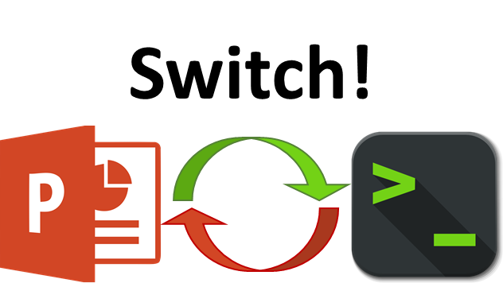

:authors: Jason Lowe-Power

Part IV: CPU models
======================================

Overview
---------

* ISAs
* What is a static instruction? (Important functions provided by decoder)

   Switch!

-------------------------------

Create SimObject
-----------------

* Get my code

.. code-block:: sh

    git remote add jason-github https://github.com/powerjg/gem5.git
    git fetch jason-github
    git checkout learningsimplecpu

* Look at LearningSimpleCPU.py

  * Talk about memory_mode soon.

* Look at cpu.hh

  * Single unified port (a little convoluted, sorry)
  * Very much like the SimpleMemobj master port
  * Important: Have a port and a thread
  * The thread is our *context*

.. code-block:: sh

    vi src/learning_gem5/LearningSimpleCPU.py
    vi src/learning_gem5/cpu.hh

-------------------------------

Initialization logic
--------------------

* Must register the thread context (look at constructor)
* Later, it will be activated in ActivateContext
* Need to do a cople of things in init, startup, and wakeup
* Finally, when the context is activated, we can kick off a fetch!

.. code-block:: sh

    vi src/learning_gem5/cpu.cc

-------------------------------

Memory request wrapper
----------------------

* Simplifies memory stuff.

  * Rather than creating/tracking packets, etc. in the CPU offload it to another object.
  * Could be used as part of LSQ in more complex design

* Give it an address for fetches or the static instruction for ld/st and it deals with "everything" else.

* Provides support for translation
  * I want to go through this

.. code-block:: sh

    vi src/learning_gem5/memory_request.cc

* Calls translateTiming on the TLB.
* The TLB works its magic (could take a while for a page walk)
* Eventually calls back to "finish()"
* (Note: must deal with split requests for x86)
* The finish eill call back to the CPU

  * Only the CPU knows how to deal with faults.

* Similarly, when the request receives a response it will call either decodeInstruction or dataResponse depending.

-------------------------------

Main CPU logic
----------------

* Look at CPU code.

.. code-block:: sh

    vi src/learning_gem5/cpu.cc

Fetch event
~~~~~~~~~~~~
* Calls translate
* (the request) Calls finishFetchTranslate
* (the request) calls decodeInstruction once we get the data.

Decoding
~~~~~~~~
* Call decoder.moreBytes
* Try to decode to get the StaticInst
* If you can't (e.g., x86 is annoying), then you have to get some more data

Next, execute!
~~~~~~~~~~~~~~
* Deal with micro-op BS (Stupid x86)
* Create an execution context.

  * This is the thing that allows the instruction implementation to effect the CPU state

* If it's a memory operation, then call initiateAcc (this will translate and setup a memory request)
* Else, do the instruction.

* For memory operations, you have to translate and deal with special memory accesses (IPR). Then send.
* Also get a response, call completeAcc (like execute, but for memory)

finishExecute (like writeback)
~~~~~~~~~~~~~~~~~~~~~~~~~~~~~~
* Mostly just do pc++
* Fetch the next instruction!

 Switch!
